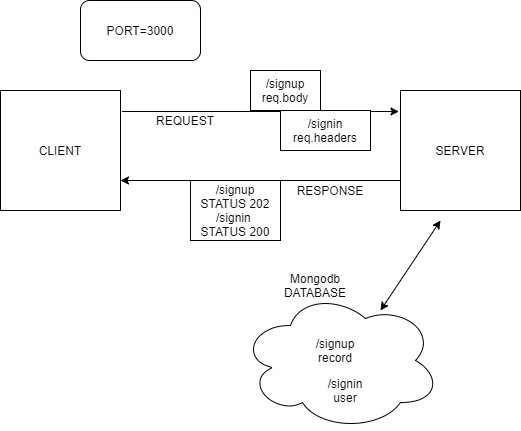

# LAB 6

## Project: Basic Auth

### Author: Stacy Burris

### Links and Resources

+ [Pull request GitHub](https://github.com/stacyburris/basic-auth/pull/7)
+ [ci/cd](https://github.com/stacyburris/basic-auth/actions)
+ [Heroku](https://stacyburris-basic-auth.herokuapp.com/)

### Setup

`.env` requirements

+ Port - 3000
+ MONGOOSE_URI=mongodb://localhost:27017/test

### How to initialize/run application

+ `npm start` or `nodemon`

### Endpoint

In Terminal

HTTP pie:

```
http POST :3000/signup
http POST :3000/signin
http POST :3000/signin -a stacy:cats
```

### Tests

+ Tests run through jest in the terminal
  + `npm test`

### UML


